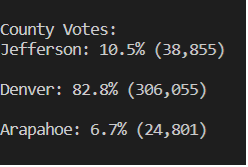
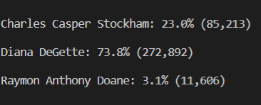

# Election-Analysis

## Overview of Election Audit
This project has the purpose of analyzing the election results through the use of python. It seeks to show the total votes, number and percentage of votes per county and candidate, as well as the county with the largest turnout and the winner of the election with its respective votes and winning percentage. 

## Election-Audit Results:

* The total number of votes in the election is 369,711
* The following image shows the results for the total votes and percentage for each county

* The county with the largest number of votes is Denver with a total of 306,055 votes.
* * The following image shows the results of the number of votes per candidate

